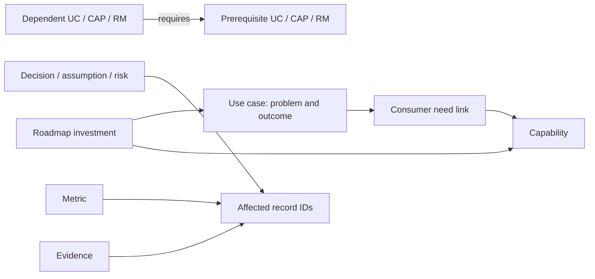

# Data contract 1.0.0

The machine-readable contract is [schemas/state.schema.json](../schemas/state.schema.json). This file explains semantics and business rules. The schema describes shape; the validator checks that shape and selected relationships. Human review establishes meaning, authority and evidence quality.

## Storage envelope and record convention

`state.json` contains `schema_version`, `store_id`, `state_revision`, `updated_at`, and arrays for the entities below. `store_id` is a stable identity for this particular work register; assign it at first real use. `state_revision` increments once per saved change set, starting at 0 for the empty starter. UTC timestamps use ISO 8601. This package does not assign actual company dates.

Every entity record has: `id`, `title`, `status`, nullable `owner`, `created_at`, `updated_at`, positive integer `record_version`, `evidence_ids` (possibly empty), and `attributes`. Required domain fields are deliberately few. Optional fields may be omitted; only nullable fields accept null. Do not use empty strings as unknown, except an intentional blank narrative should be omitted instead.

Use stable prefixed IDs with at least three digits, allocated by the single writer. Never renumber on sorting or reuse retired IDs. Titles can change independently. A duplicate title is a review warning, not necessarily a duplicate entity. The global version detects stale snapshots; per-record versions support focused reconciliation.

## Entities and relationships

| Collection / ID | Purpose | Required attributes | Selected optional attributes |
|---|---|---|---|
| `use_cases` / UC | Outcome-bearing user problem/investment | `problem`, `users`, `outcome` | product_area, sponsor, alternatives, strategic_fit, constraints, delivery_links, metric_ids |
| `capabilities` / CAP | Enduring ability with a consumer proposition | `description`, `classification` | consumer_proposition, service_contract, current/tactical/target_implementation, migration_trigger/path, expected_lifespan, reversibility, metric_ids |
| `use_case_capabilities` / LNK | Many-to-many demand relationship, not automatically a blocker | `use_case_id`, `capability_id`, `need`, `demand_state` | consumer_requirements |
| `roadmap_items` / RM | Outcome, capability, learning, migration or retirement investment | `outcome`, `horizon`, `kind`, `priority`, `confidence` | use_case_ids, capability_ids, metric_ids, priority_rationale, readiness_condition, exit_criteria, effort, capacity_basis, date/date_kind/date_source, experiment |
| `dependencies` / DEP | Directed prerequisite with explicit evidence/confirmation | `dependent_id`, `prerequisite_id`, `reason`, `type`, `strength` | satisfaction_condition, resolution, needed_by |
| `decisions` / DEC | Choice and rationale preserved across time | `question`, `options`, `rationale`, `target_ids`, `provisional` | chosen_option, decided_on, consequences, reversibility, revisit_trigger, assumption_ids, supersedes_id |
| `assumptions` / ASM | Material testable proposition | `statement`, `target_ids`, `impact_if_false`, `test_or_trigger` | test_result |
| `risks` / RISK | Uncertain exposure or occurred issue | `kind`, `cause_event_consequence`, `target_ids`, `likelihood`, `impact` | response, trigger, acceptance_or_closure_basis |
| `metrics` / MET | Definition and dated observations | `definition`, `unit`, `direction`, `target_ids`, `source`, `cadence` | baseline, target, observations, attribution_limits |
| `evidence` / EVD | Traceable bounded claim | `claim`, `source`, `observed_on`, `basis`, `limitations` | target_ids, strength |

Required fields mean required when the record is persisted, not that the assistant must collect all facts before helping. If the user cannot yet state a use-case outcome, keep the intake as a provisional brief until a meaningful hypothesis can be recorded. Hypothesized content must remain labeled through evidence/assumptions and status.

Collections may remain empty until needed. Outcome and Objective are represented by outcome/strategy fields and metric links; Product and Platform are scope labels and capability roles initially. Stakeholders are owner/sponsor fields with roles in organization context. Experiment is a structured part of a learning roadmap item. ArchitectureOption is a decision option. Constraint is a sourced use-case constraint and, when it blocks work, a dependency or risk. This avoids a registry for every concept while retaining their reasoning.

## Relationship view

Demand links express “this consumer needs this capability.” Dependencies express “this work requires that prerequisite under this condition.” Keep them separate to avoid inferring delivery blockers from capability maps. A dependency points from dependent to prerequisite. Target IDs may refer to any entity except self; use-case/capability/roadmap links are type-specific.

## Lifecycle rules

| Entity | Allowed statuses | Transition semantics |
|---|---|---|
| Use case | idea, discovery, candidate, active, production, paused, stopped, retired | Discovery/candidate are options; active is selected work; production requires actual release/readiness basis. Pause/stop need rationale; retirement needs consumer/operational closure. |
| Capability | candidate, piloting, available, deprecated, retired | Available needs real availability/support evidence; deprecated remains supported under a transition plan. |
| Demand link | active, withdrawn | demand_state is separately hypothesized, confirmed or adopted; adopted means actual consumer use. |
| Roadmap item | proposed, selected, in_progress, achieved, paused, stopped | Achieved means its explicit exit criteria have evidence; it need not mean a business outcome has already been realized. |
| Dependency | hypothesized, confirmed, resolved, rejected | Confirmation validates the relationship; resolved records the satisfaction/removal basis. |
| Decision | proposed, adopted, superseded, withdrawn | Adopted requires a chosen option, owner, date and rationale; superseding preserves the earlier record. |
| Assumption | open, validated, invalidated, retired | Validation/invalidation needs bounded test evidence/result. |
| Risk | open, mitigating, accepted, closed | Acceptance/closure needs basis; accepted needs an owner. |
| Metric | proposed, active, retired | Active means collection/use is operational, not that targets are met. |
| Evidence | current, superseded, withdrawn | Current does not mean strong or fresh; source/date/limitations remain material. |

These are not rigid one-way stage gates. Legitimate backtracking is allowed when recorded with rationale. Changes to major lifecycle states should link to decision/evidence and appear in history. Business rules beyond machine validation require agent review; do not imply the validator verifies governance readiness.

## Referential and consistency rules

- IDs are unique across the state. All links must resolve; no self dependency, self target or self supersession.
- Use-case/capability links are unique per pair. Relationship changes update the link version; historical states retain withdrawn/changed information.
- A hard, confirmed dependency graph must be acyclic before an executable sequence is asserted. Store discovery of a real cycle if necessary, report it as an unresolved warning, and do not invent a feasible ordering.
- A date on a roadmap item requires its kind and source; don't infer a commitment from the date alone.
- A learning item with an experiment includes hypothesis, method, cohort, success criteria, stopping rule and decision implication.
- Metric target/baseline objects contain a numeric value and an as-of date. Each observation has its own date. Unknown values are absent/null only where allowed, not zero.
- An adopted decision must name one of its supplied options. A superseding link points to a prior decision; the prior status becomes superseded. Never edit the old rationale to match the new choice.
- `created_at` ≤ `updated_at` ≤ state `updated_at`; writes preserve creation time and increment changed record versions once.
- Schema changes require a named migration and a new schema version. Record-version increments are not schema migrations.

## Extending the model

Add a first-class Product/Platform/Objective only when it has independent ownership/lifecycle or repeated many-to-many relationships that are awkward as fields. Add a stakeholder directory only when identity resolution is needed. Add metric-observation tables when history volume warrants them. Preserve existing IDs and keep one-way derived views distinguishable from authoritative records.

Use the schema as the syntax authority and this file as the semantics authority. If they disagree, flag the inconsistency and resolve it before a write; do not silently broaden the contract.
